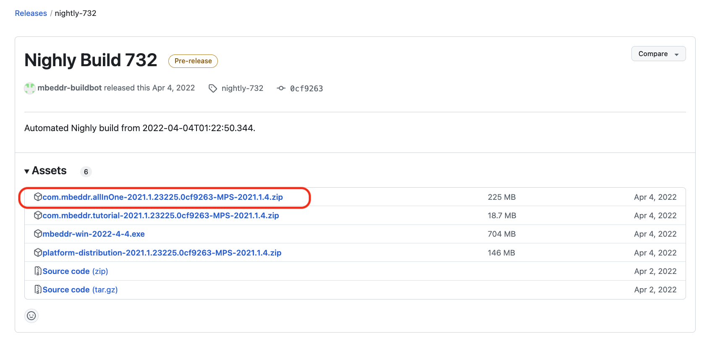
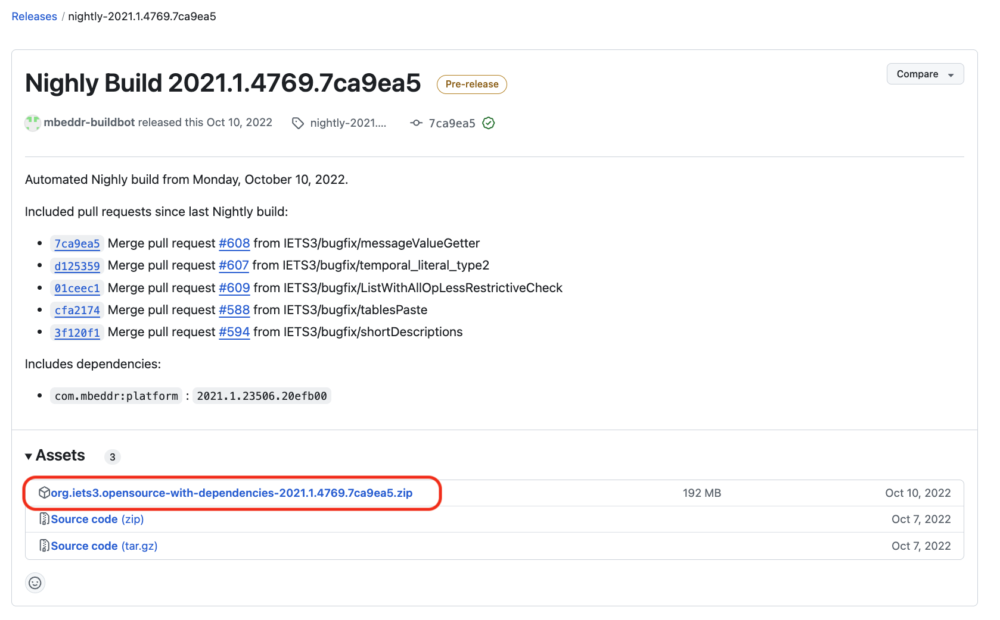
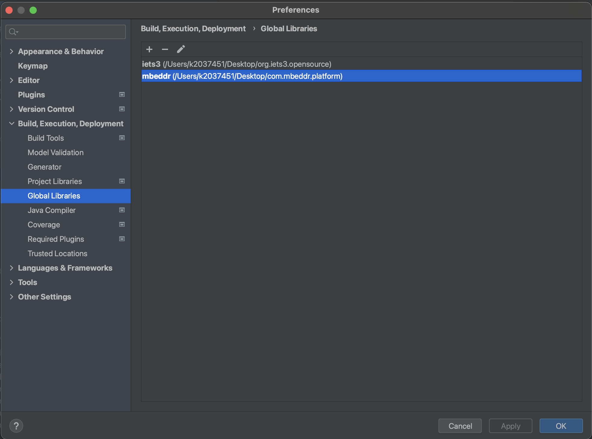
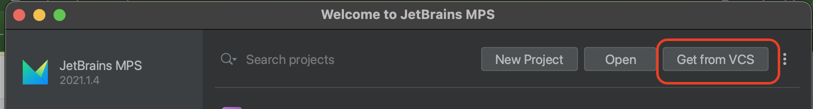
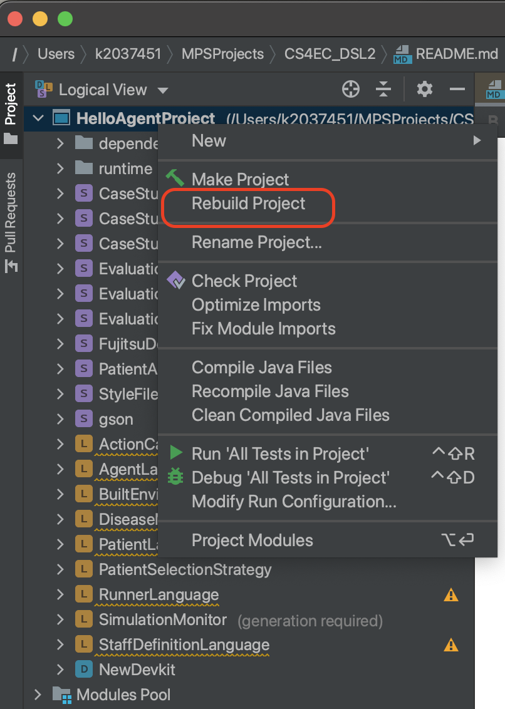
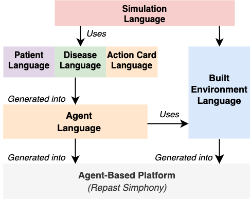
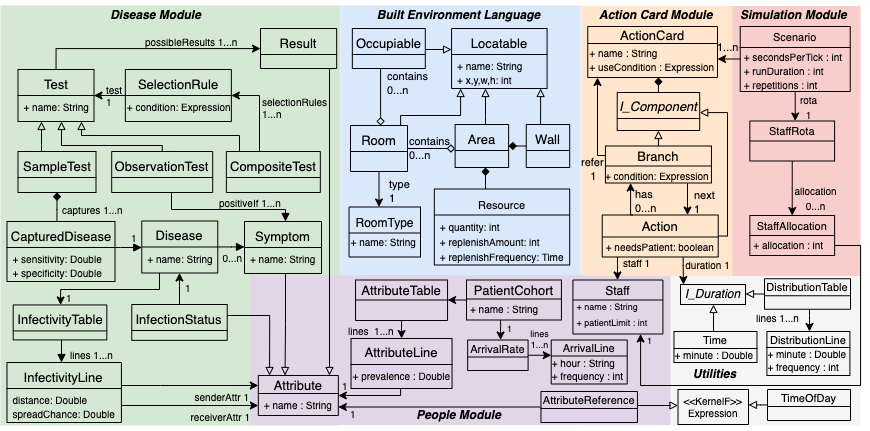

# CS4EC_DSML
---------
The CS4EC DSML is designed to facilitate the participatory development of agent-based models of hospital emergency departments. We intend for these ABMs to be used to evaluate and compare the efficacy of past, present, or future workplace interventions according to directional changes in key performance indicators (KPI) such as patient waiting time, patient risk, resource usage, etc. For example, the DSML could be used to model an intervention such as adding a new type of diagnostic test for an infectious disease to a patient pathway. By modelling the domain processes before and after the addition of the new test, we can measure any directional changes in KPIs to indicate the effectiveness of that intervention. 

## Repository Contents: 
- Our DSML modules can be found in the [Languages](languages) folder.
- Our example models can be found in the [Solutions](solutions) folder.

## Technologies:
- The DSML has been developed with [Jetbrains MPS](https://www.jetbrains.com/mps/).
- The target language for our DSML (and therefore the execution environment for generated ABMs) is [Repast Simphony](https://repast.github.io/).

## DSML Installation Instructions:
1. Install Jetbrains MPS 2021.1.4 (https://www.jetbrains.com/mps/download/previous.html)

2. Follow the following link to the Mbeddr Github page for the MPS2021.1 release. Download the .zip and extract the locally on your machine (https://github.com/mbeddr/mbeddr.core/releases/tag/nightly-732):
  

3. Follow the following link to the iets3 Github page for the MPS2021.1 release. Download the .zip and extract locally to your machine (https://github.com/IETS3/iets3.opensource/releases/tag/nightly-2021.1.4769.7ca9ea5):
  

4. Open your MPS, and on the main window go to Customize → All Settings →Build, Execution, Deployment → Global Libraries, and within that window, add the two folders you downloaded and extracted in Steps 2 and 3. 
  

5. Get the DSML project from GitHub and import via vcs on MPS. 
  

6. Open the imported project in MPS. If you receive a large number of errors, please fully restart MPS so that the program can re-organise the new global libraries.

7. Re-build the entire project. Ignore any errors as these are related to the build order between the MPS Languages. 
  

8. The DSML should now be installed!

## Repast Simphony Installation Instructions:
1. Install the latest version of Repast Simphony. 
2. Open Repast Simphony (Eclipse) and import the git project into your workspace via import → Git → Projects from Git → Projects from Git → Existing Local Repository
    1. Then select the repo that can be found in your mpsProjects directory (the same location as imported into MPS above)
3. To run the model, you may be required to add a new run configuration for the imported EDProject project inside Eclipse. This can be done via right-clicking the EDProject project file, then selecting Properties → Run/Debug Settings and select EDProject model
    1. Note: The options for ‘Batch Model’, ‘Installer’, ‘Portable Archive’ can also be selected depending on your needs. 
        1. Batch Model will open a batch-running window in which parameter sweeps can be configured for multiple model runs. In this mode, no graphical UI is shown during model runs
        2. Installer and Portable Archive are used for installing the model as a standalone executable on your machine or a different machine (via the portable archive)

## Software Architecture:
The CS4EC DSML consists of multiple DSML modules. Each language module covers a distinct aspect of the healthcare domain. We show all the DSML modules and their dependencies in the following image: 

 

> The **action card module** is responsible for defining high-level global processes including action cards and the details on action durations, required staff, etc.

> The **people module** is responsible for capturing the properties of staff and patients.

> The **disease module** is responsible for defining the properties of diseases, their prevalence, spread properties, and the tests used to detect diseases. 

> The **simulation module** is responsible defining the parameters for individual model runs. This includes details on staff allocations and run durations, tick rate, and repetitions. 
      
> The **built environment language** sits at its own abstraction level and is used by both the healthcare language and the agent language. This module is responsible for defining the physical layout of the environment, including the definition of rooms and resources within the hospital. 
      
> The **agent language** is an intermediary, agent-oriented, DSML designed to subdivide the model generation process. This language is responsible for the definition of individual agents, their attributes, behaviours, and message passing. All models written in the healthcare language are automatically generated into the agent language.

> All models are automatically generated from the agent language into our base language: Repast Simphony. At this stage, models can be executed for experiments.

## DSML Meta-model:

Below is an image showing the full meta-model of the DSML in its current state. This represents the language concret syntax: showing every concept included in the DSML and their relationships. Full details about this meta-model are discussed in [[1]](#1).

 

## Case Studies: 

### 1. DSML Feasibility Case Study - Modelling of COVID-19 risk factors in St. Thomas’ ED
> The aim of this case study was to determine the feasibility of implementing a DSML develop a model that could sufficiently capture healthcare domain processes and produce experimental data of value to our domain experts. Primarily, we were concerned with developing a model that could be sufficiently recognisable to experts in the healthcare domain such that they could view our models with initial credibility--- using this case study as a proof of concept.

> The specific purpose of our model, is to predict and compare the performance of different COVID-19 testing schemes (aka different action cards) according to relative directional changes in KPI metric values for each testing scheme. These KPIs are:

>  * The percentage chance of a COVID-19-positive patient being admitted to an Amber admission bay (which we refer to as `risk'). 
>  * The patient length of stay in the ED (LoS). 
>  * The number of tests used. 

> The intention of our case study is to compare the 3 provided action cards according to their performance as measured by the stated KPIs, across a range of COVID-19 prevalence rates. We therefore performed multiple runs of each action card across a range of COVID-19 prevalence rates as model inputs and compare the performance at each prevalence rate.

The model used for this case study can be found in: [Case Study 1](solutions/ActionCardWinter2021).
The generated model Java classes can be found in: [generated java classes](solutions/ActionCardWinter2021/source_gen/EDLanguage/sandbox).
The model parameters and data output formats can be found in [model parameters](solutions/ActionCardWinter2021/classes_gen/ActionCardWinter2021/AC1).

### 2. DSML Extension Case Study - Modelling COVID-19 and Influenza novel testing processes in St. Thomas' ED
> The intention of this case study was to determine whether our DSML was fit-for-purpose to be applied to an alternative problem and context but within the same emergency care domain.  

> The purpose of this model is largely similar to that of the previous case study described above. The model will be used to predict and compare the performance of different action cards describing COVID-19 **and Influenza** testing schemes.

> The infection control and ED teams wished to use our models to explore the cost/benefit potential of introducing dual-cassette LFTs compared to remaining with the COVID-19-only LFT under symptomatic-only testing guidelines. They wished to explore the efficacy of the dual-cassette LFTs under varying Influenza prevalence rates, and the impact of these tests on KPIs including usage rates of PCR tests and the risk of Influenza-positive patients being admitted to a cohort containing non-infectious patients or a cohort containing COVID-19-positive patients. The domain experts defined two action cards for us to model: One using dual-cassette LFTs and one using COVID-only LFTs. We were supplied representative patient arrival rates and disease prevalence rates for the Winter period. Data on the sensitivity and specificity of the dual-cassette LFTs were available from the device manufacturer.

>  The metrics by which we measure action card performance (aka the KPIs) are:

>  * The number of patients who are admitted to an incorrect ward according to their infection status
>  * Resource usage for rapid-PCR tests and dual-cassette LFTs
>  * The length-of-stay of patients 

The models used for this case study are split between two projects: One project representing _before_ dual-cassette LFTs were introduced, and one represnting _after_ dual-casssette LFTs were introduced. The models for both projects can be found in: [Before Dual-Cassette Model](solutions/DualCassetteInterventionPreChange) and [after Dual-Cassette Model](solutions/DualCassetteIntervention).
The generated model Java classes can be found in: [Before Dual-Cassette Java classes](solutions/DualCassetteInterventionPreChange/source_gen/EDLanguage/sandbox) and [after Dual-Cassette Java classes](solutions/DualCassetteIntervention/source_gen/EDLanguage/sandbox).
The model parameters and data output formats can be found in [Before Dual-Cassette model parameters](solutions/DualCassetteInterventionPreChange/source_gen/DualCassetteInterventionPreChange/AC1) and [after Dual-Cassette model paramaters](solutions/DualCassetteIntervention/source_gen/DualCassetteIntervention/AC1).

## Evaluation Models
As part of the evaluation chapter of the thesis (chapter 10), we conducted a comparison workshop in which we presented a demonstration model in both our DSML and in FlexSim. 
The descriptions of these models are included in the thesis text, however, the models themselves are linked below:

 [Model in the DSML](solutions/EvaluationComparisonStudy/models/EvaluationComparisonStudy.AC1.mps)
 Please import this model into your local MPS installation with the DSML configured as described above.
 
 [Model in FlexSim](CaseStudies/HealthcareModel.fsm)
 Please download the trial version of FlexSim from the official FlexSim [website](https://www.flexsim.com/). 
 The provided .fsm file can then be imported into your local FlexSim installation

## References
<a id="1">[1]</a> 
Godfrey, T., Zschaler, S., Batra, R., Douthwaite, S., Edgeworth, J., Edwards, M., and
Miles, S. (2023) 
Supporting Emergency Department Risk Mitigation with a Modular
and Reusable Agent-Based Simulation Infrastructure 
Winter Simulation Conference 2023.
